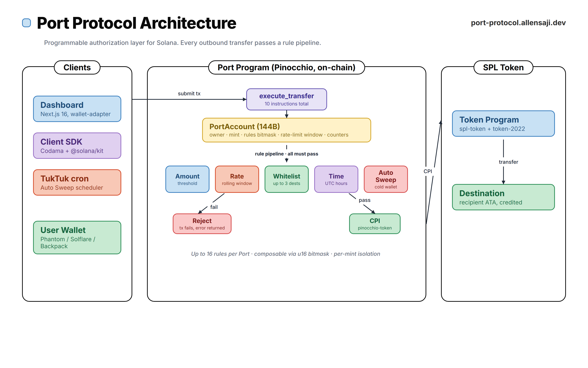

# diagram-kit

Reusable React + Remotion toolkit for generating ByteByteGo-style technical
diagrams as PNGs and animated MP4s from the same component library. Includes
a self-correction pipeline: a debug overlay and a headless collision checker
that render the composition, extract every element's bounding box, and flag
overlaps and arrow crossings before you ship.

## Previews

**Port Protocol** — programmable authorization layer for Solana:



**px402** — private agent payments on MagicBlock PER (15s MP4):

Animated MP4 sample at [`docs/samples/px402-animated.mp4`](docs/samples/px402-animated.mp4).

## Why

Off-the-shelf tools (Mermaid, D2, Graphviz) don't produce the ByteByteGo
aesthetic — pastel cards, pill-labelled panels, typography-heavy layouts.
That look is typically hand-crafted in draw.io. This repo brings it back
into code: one set of React components, one palette, static PNG and
animated MP4 from the same source.

## Stack

- [Remotion](https://remotion.dev) 4.0.x for programmatic rendering
- React 19 + Tailwind v4 (`@remotion/tailwind-v4`) for styling
- `@remotion/google-fonts` for Inter + JetBrains Mono
- H.264 / yuv420p MP4 output tuned for Twitter/X specs

## How to use this

There are two ways to drive the kit:

### 1. Directly, writing compositions by hand

```bash
git clone git@github.com:Allen-Saji/diagram-kit.git
cd diagram-kit
npm install
npx remotion studio                  # live preview in your browser
```

Create a new file under `src/compositions/projects/<Name>.tsx`, register it
in `src/Root.tsx`, then render. See [Adding a new diagram](#adding-a-new-diagram)
below for the full ritual.

### 2. Via the companion Claude Code skill (recommended)

This repo ships with a [Claude Code](https://claude.com/claude-code) skill that
encodes the full kit API, composition workflow, and all the conventions the
checker enforces. Install it to your global skills folder:

```bash
mkdir -p ~/.claude/skills/diagram-kit
curl -o ~/.claude/skills/diagram-kit/SKILL.md \
  https://raw.githubusercontent.com/Allen-Saji/diagram-kit/main/SKILL.md
```

Once installed, any session where you say *"diagram the px402 flow"*,
*"visualize the Port Protocol architecture"*, or *"make a BBG-style animated
MP4 of this"* will pick up the skill, read the full kit surface area, draft
a composition, iterate against the checker, and render final assets — without
you re-reading `src/kit/*.tsx` every time.

The skill lives in the repo root as `SKILL.md` so it stays versioned with the
code it describes.

### Best-use workflow

1. **Describe the system** you want to diagram (architecture, sequence, or
   flow). The skill will pick the right primitives.
2. **Let the skill draft** the composition in `src/compositions/projects/`
   with every element tagged for the collision checker.
3. **Iterate with debug overlay** — `scripts/iterate.sh <Name> --debug`
   renders a 0.5x preview with red bbox outlines and labels on every placed
   kit element.
4. **Run the checker** — `node scripts/check.mjs <Name>` flags arrow-vs-card
   crossings, orphan text in the path of an arrow, and primitive overlaps.
   Zero collisions = ready to render.
5. **Render** — `scripts/render-png.sh <Name> hd` for a 2x retina still,
   `scripts/render-mp4.sh <Name> tweet-16x9` for a Twitter-ready MP4.

## Render commands

Render a still to PNG:

```bash
scripts/render-png.sh <Name>           # native composition dims
scripts/render-png.sh <Name> hd        # 2x density for retina
```

Render an animated composition to MP4:

```bash
scripts/render-mp4.sh <Name>                # 1920 x 1080, 8 Mbps
scripts/render-mp4.sh <Name> tweet-sq       # 1080 x 1080
```

Iterate on a composition (fast, low-res, with optional debug overlay):

```bash
scripts/iterate.sh <Name>               # out/iter/<Name>.png
scripts/iterate.sh <Name> --debug       # out/iter/<Name>.debug.png
scripts/iterate.sh <Name> --full        # same as render-png.sh but scale=1
```

Check a composition for collisions (headless, deterministic):

```bash
node scripts/check.mjs <Name>           # pass/fail + JSON report
node scripts/check.mjs <Name> --min-area=32
```

Outputs land in `out/`. Committed reference renders live in `docs/samples/`.

## Presets

**PNG** (`scripts/render-png.sh`) — presets only control DPI/scale. Output
aspect ratio matches the composition's `<Still width/height>`:

| Preset   | Scale | Use                            |
|----------|-------|--------------------------------|
| `blog`   | 1x    | Default                        |
| `hd`     | 2x    | Retina / high-density displays |
| `ultra`  | 3x    | Print / hero                   |

**MP4** (`scripts/render-mp4.sh`):

| Preset       | Dimensions    | Bitrate | Use                          |
|--------------|---------------|---------|------------------------------|
| `tweet-16x9` | 1920 x 1080   | 8 Mbps  | Twitter/X landscape (default)|
| `tweet-sq`   | 1080 x 1080   | 8 Mbps  | Twitter/X square             |
| `tweet-9x16` | 1080 x 1920   | 12 Mbps | Twitter/X vertical           |
| `blog`       | 1280 x 720    | 4 Mbps  | Embedded in blog post        |

Non-premium X upload limits: <=140 s, <=512 MB, H.264/AAC MP4.

**Important:** set your composition's `<Canvas w h>` and the `<Composition
width height>` in `Root.tsx` to match the preset you'll render at. A 1600x1000
canvas rendered as `tweet-16x9` (1920x1080) will be letterboxed/padded.

## Project layout

```
src/
  kit/                        design system
    palette.ts                pastel bg/border/text swatches
    fonts.ts                  Inter + JetBrains Mono
    Canvas.tsx                fixed-size absolute-positioning canvas + debug
    Debug.tsx                 DebugContext, DebugOverlay, bbox emitter
    Panel.tsx                 framed section with pill-label title
    Card.tsx                  colored rounded card (title + subtitle)
    TreeNode.tsx              B-tree / B+ tree node
    FlowBox.tsx               rounded flow step
    Arrow.tsx                 straight/elbow arrows with label + draw-in
    Annotation.tsx            red/gray italic side notes
    Label.tsx                 non-italic section header (tracked)
    Title.tsx                 headline with color accent + right slot
  animation/
    primitives.tsx            Appear, ScaleIn, DrawArrow, Pulse, Hold, Typewriter
  compositions/
    fidelity/                 ByteByteGo reference clones
      BTreeVsBPlus.tsx
      LsmTrees.tsx
      LsmCompaction.tsx
    projects/                 real project architecture diagrams
      Px402Static.tsx
      Px402Animated.tsx
      PortProtocolArch.tsx
      DiagramKitArch.tsx
      DiagramKitArchAnimated.tsx
  Root.tsx                    registers Still / Composition
  index.ts                    Remotion entry point

scripts/
  render-png.sh               preset-based PNG render
  render-mp4.sh               preset-based MP4 render (H.264, yuv420p)
  iterate.sh                  fast low-res render with --debug overlay
  check.mjs                   headless collision checker with JSON report

docs/samples/                 committed reference PNGs + MP4
SKILL.md                      Claude Code skill definition
```

## Self-correction pipeline

The kit supports a closed-loop "render, inspect, fix" workflow that catches
layout bugs deterministically.

1. Every kit primitive accepts an optional `debugId`. Pass a composition-unique
   string for every placed element.
2. Each composition accepts a `debug?: boolean` prop and forwards it to
   `Canvas`, which wraps children in a `DebugProvider`.
3. When debug emit is on:
   - `DebugOverlay` emits `BBOX::{…}` for every tagged element.
   - `Arrow` emits `ARROW::{segments:…}` for every tagged arrow.
   - `Canvas` walks the DOM post-layout and emits `ORPHAN::{rect:…}` for
     any text node not inside a kit primitive — catches raw `<div>` text
     that the checker would otherwise miss.
4. `scripts/check.mjs` captures all three log streams via Remotion's
   `onBrowserLog`, runs pairwise bbox overlap for cards, and Liang-Barsky
   segment-vs-rect intersection for arrows against cards + orphan text
   (5 px margin so arrows at card edges don't false-positive). Exits 1 on
   any collision.

Typical loop:

```bash
# see what's where
scripts/iterate.sh MyDiagram --debug

# verify it's clean before shipping
node scripts/check.mjs MyDiagram
# ✓ MyDiagram: 12 elements + 5 arrows + 0 orphan text, 0 collisions

# final render
scripts/render-png.sh MyDiagram hd
```

## Adding a new diagram

1. Create `src/compositions/projects/<Name>.tsx`. Accept an optional
   `debug?: boolean` prop and thread it into `Canvas`. Compose with
   `Canvas`, `At`, `Card`, `TreeNode`, `FlowBox`, `Arrow`,
   `Annotation`, `Label`, `Title`. Give every placed kit primitive a
   stable `debugId`.
2. Register in `src/Root.tsx` as `<Still>` (PNG) or `<Composition>` (MP4),
   plus a `<Still>` variant in the `debug` folder with
   `defaultProps={{ debug: true }}` so `iterate.sh --debug` finds it.
3. Render: `scripts/render-png.sh <Name> blog` or
   `scripts/render-mp4.sh <Name> tweet-16x9`.

For animated variants: wrap elements in `Appear`, `DrawArrow`,
`Pulse`, or `ScaleIn` from `src/animation`. All animation must go
through `useCurrentFrame()`. CSS `transition`/`animation` and
Tailwind `animate-*` classes don't render correctly in Remotion.

## Palette

Eight pastel families sampled from ByteByteGo reference diagrams:
mint, peach, blue, yellow, pink, purple, plus lavender and gray
neutrals. Each family exposes matching `bg`, `border`, and `text`
colors designed to read together. See `src/kit/palette.ts`.

## Conventions

- **No CSS animations.** Every moving thing reads `useCurrentFrame()`.
- **Absolute layout.** `Canvas` + `At` give you deterministic control
  over every pixel, the way ByteByteGo diagrams are hand-placed.
- **One font family active.** Inter for prose, JetBrains Mono for
  addresses / hashes / log fragments.
- **No raw `<div>` for text.** Use `Label`, `Annotation`, or `Title`.
  The orphan walker catches bare divs at check time.
- **Panel takes no `debugId`.** Panels are semantic containers that
  wrap their children; tagging a Panel makes the checker flag every
  contained card. The panel's pill title auto-registers separately.
- **Annotation tones.** Red italic for walkthroughs. Gray italic for
  ambient notes.
- **debugId on every placed element.** Keeps the collision checker
  informed; has zero effect on production renders.

## License

Remotion: free for teams of up to 3, otherwise see
[remotion.dev/license](https://www.remotion.dev/docs/license).
Everything else in this repo: MIT.
