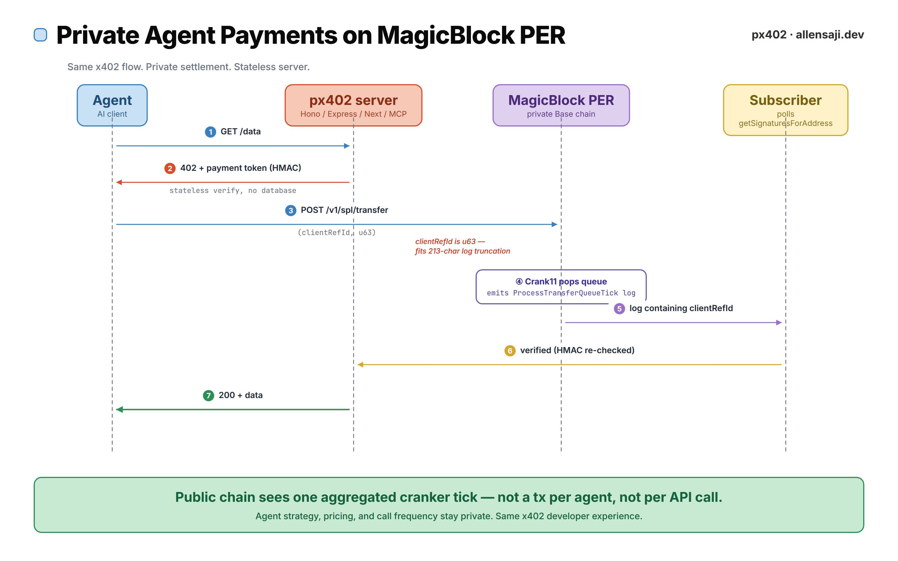
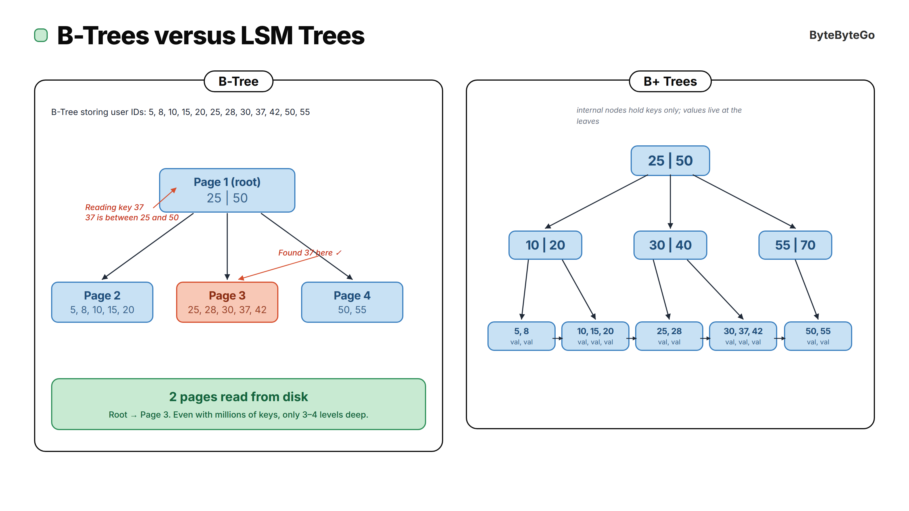
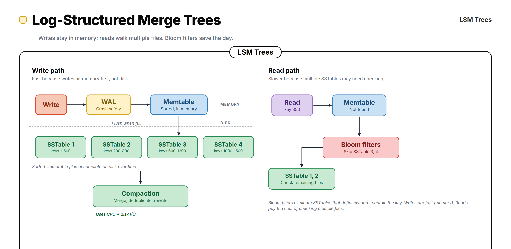
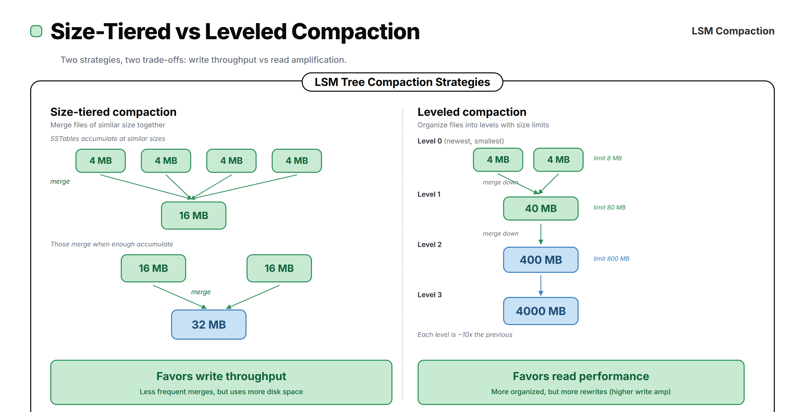

# diagram-kit

Reusable React + Remotion toolkit for generating ByteByteGo-style technical
diagrams as PNGs and animated MP4s from the same component library. Includes
a self-correction loop: a debug overlay and a headless collision checker that
render the composition, extract every element's bounding box, and flag overlaps.

## Preview

**px402 architecture** — private agent payments on MagicBlock PER:



**ByteByteGo fidelity clones** — B-Trees vs B+ Trees, LSM Trees, LSM Compaction:







Animated MP4 sample at [`docs/samples/px402-animated.mp4`](docs/samples/px402-animated.mp4).

## Why

Off-the-shelf tools (Mermaid, D2, Graphviz) don't produce the ByteByteGo
aesthetic — pastel cards, pill-labelled panels, typography-heavy layouts.
That look is typically hand-crafted in draw.io. This repo brings it back
into code: one set of React components, one palette, static PNG and
animated MP4 out of the same source.

## Stack

- [Remotion](https://remotion.dev) 4.0.x for programmatic rendering
- React 19 + Tailwind v4 (`@remotion/tailwind-v4`) for styling
- `@remotion/google-fonts` for Inter + JetBrains Mono
- H.264 / yuv420p MP4 output tuned for Twitter/X specs

## Quickstart

```bash
npm install
npx remotion studio                  # live preview
```

Render a still to PNG:

```bash
scripts/render-png.sh Px402Static           # native composition dims
scripts/render-png.sh Px402Static hd        # 2x density for retina
```

Render an animated composition to MP4:

```bash
scripts/render-mp4.sh Px402Animated                # 1920 x 1080, 8 Mbps
scripts/render-mp4.sh Px402Animated tweet-sq       # 1080 x 1080
```

Iterate on a composition (fast, low-res, with optional debug overlay):

```bash
scripts/iterate.sh Px402Static               # out/iter/Px402Static.png
scripts/iterate.sh Px402Static --debug       # out/iter/Px402Static.debug.png
scripts/iterate.sh Px402Static --full        # same as render-png.sh but via scale=1
```

Check a composition for element collisions (headless, deterministic):

```bash
node scripts/check.mjs Px402Static           # pass/fail + JSON report
node scripts/check.mjs Px402Static --min-area=32
```

Outputs land in `out/`. Committed reference renders live in `docs/samples/`.

## Presets

**PNG** (`scripts/render-png.sh`) — presets only control DPI/scale. Output
aspect ratio matches the composition's `<Still width/height>`:

| Preset   | Scale | Use                            |
|----------|-------|--------------------------------|
| `blog`   | 1x    | Default                        |
| `hd`     | 2x    | Retina / high-density displays |
| `ultra`  | 3x    | Print / hero                   |

**MP4** (`scripts/render-mp4.sh`):

| Preset       | Dimensions    | Bitrate | Use                          |
|--------------|---------------|---------|------------------------------|
| `tweet-16x9` | 1920 x 1080   | 8 Mbps  | Twitter/X landscape (default)|
| `tweet-sq`   | 1080 x 1080   | 8 Mbps  | Twitter/X square             |
| `tweet-9x16` | 1080 x 1920   | 12 Mbps | Twitter/X vertical           |
| `blog`       | 1280 x 720    | 4 Mbps  | Embedded in blog post        |

Non-premium X upload limits: <=140 s, <=512 MB, H.264/AAC MP4.

## Project layout

```
src/
  kit/                        design system
    palette.ts                pastel bg/border/text swatches
    fonts.ts                  Inter + JetBrains Mono
    Canvas.tsx                fixed-size absolute-positioning canvas + debug
    Debug.tsx                 DebugContext, DebugOverlay, bbox emitter
    Panel.tsx                 framed section with pill-label title
    Card.tsx                  colored rounded card (title + subtitle)
    TreeNode.tsx              B-tree / B+ tree node
    FlowBox.tsx               rounded flow step
    Arrow.tsx                 straight/elbow arrows with optional label + draw-in
    Annotation.tsx            red/gray italic side notes
    Title.tsx                 headline with color accent + right slot
  animation/
    primitives.tsx            Appear, ScaleIn, DrawArrow, Pulse, Hold, Typewriter
  compositions/
    BTreeVsBPlus.tsx          B-Tree vs B+ Tree (BBG reference, top row)
    LsmTrees.tsx              LSM write + read paths (BBG reference)
    LsmCompaction.tsx         Size-tiered vs leveled compaction (BBG reference)
    Px402Static.tsx           px402 architecture, static sequence diagram
    Px402Animated.tsx         px402 architecture, 15s MP4 version
  Root.tsx                    registers Still / Composition
  index.ts                    Remotion entry point

scripts/
  render-png.sh               preset-based PNG render
  render-mp4.sh               preset-based MP4 render (H.264, yuv420p)
  iterate.sh                  fast low-res render with --debug overlay
  check.mjs                   headless collision checker with JSON report

docs/samples/                 committed reference PNGs + MP4
```

## Self-correction loop

The kit supports a closed-loop "render, inspect, fix" workflow.

1. Every kit primitive (`Card`, `Panel`, `TreeNode`, `FlowBox`, `Annotation`)
   accepts an optional `debugId` prop. Pass a composition-unique string for
   every placed element.
2. Each composition accepts a `debug?: boolean` prop and forwards it to
   `Canvas`, which wraps children in a `DebugProvider`.
3. When `debug` is on, `DebugOverlay` renders a red dashed outline plus a
   small top-left tag (`kind·debugId`) for every element. It also emits
   the element's measured bounding box via `console.log("BBOX::…")` in a
   `useLayoutEffect`.
4. `scripts/check.mjs` bundles the project, calls `renderStill` with a
   custom `onBrowserLog` handler that captures the `BBOX::` lines, runs a
   pairwise overlap check with an area threshold, and emits a JSON report
   plus a terminal summary. Exits 1 on any overlap.

Typical loop:

```bash
# see what's where
scripts/iterate.sh MyDiagram --debug

# verify it's clean before shipping
node scripts/check.mjs MyDiagram
# ✓ MyDiagram: 12 elements, 0 collisions

# final render
scripts/render-png.sh MyDiagram hd
```

## Adding a new diagram

1. Create `src/compositions/MyDiagram.tsx`. Accept an optional
   `debug?: boolean` prop and thread it into `Canvas`. Compose with
   `Canvas`, `At`, `Card`, `TreeNode`, `FlowBox`, `Arrow`,
   `Annotation`, `Title`. Give every placed kit primitive a stable
   `debugId`.
2. Register in `src/Root.tsx` as `<Still>` (PNG) or `<Composition>` (MP4),
   plus a `<Still>` variant in the `debug` folder with
   `defaultProps={{ debug: true }}` so `iterate.sh --debug` finds it.
3. Render: `scripts/render-png.sh MyDiagram blog` or
   `scripts/render-mp4.sh MyDiagram tweet-16x9`.

For animated variants: wrap elements in `Appear`, `DrawArrow`,
`Pulse`, or `ScaleIn` from `src/animation`. All animation must go
through `useCurrentFrame()`. CSS `transition`/`animation` and
Tailwind `animate-*` classes don't render correctly in Remotion.

## Palette

Six pastel families sampled from ByteByteGo reference diagrams:
mint, peach, blue, yellow, pink, purple, plus lavender and gray
neutrals. Each family exposes matching `bg`, `border`, and `text`
colors designed to read together. See `src/kit/palette.ts`.

## Conventions

- **No CSS animations.** Every moving thing reads `useCurrentFrame()`.
- **Absolute layout.** `Canvas` + `At` give you deterministic control
  over every pixel, the way ByteByteGo diagrams are hand-placed.
- **One font family active.** Inter for prose, JetBrains Mono for
  addresses / hashes / log fragments.
- **Annotation tones.** Red italic for walkthroughs. Gray italic for
  ambient notes.
- **debugId on every placed element.** Keeps the collision checker
  informed; has zero effect on production renders.

## License

Remotion: free for teams of up to 3, otherwise see
[remotion.dev/license](https://www.remotion.dev/docs/license).
Everything else in this repo: MIT.
