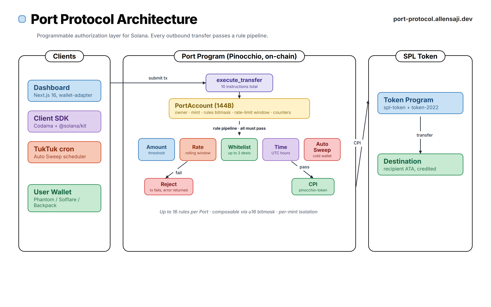

# diagram-kit

React + Remotion toolkit for ByteByteGo-style technical diagrams. One set
of components, one palette, one composition source — emit a static PNG
for the blog or an animated MP4 for Twitter. A headless collision
checker reads every element's bounding box back out of the render and
fails the build before bad layouts ship.

## Previews

**Port Protocol** — programmable authorization layer for Solana:



**px402** — private agent payments on MagicBlock PER (15 s MP4):

Animated MP4 sample at [`docs/samples/px402-animated.mp4`](docs/samples/px402-animated.mp4).

## Why

Mermaid, D2, and Graphviz can't produce the ByteByteGo aesthetic —
pastel cards, pill-titled panels, typography-heavy layouts. That look
gets hand-crafted in draw.io, which is not code-driven and does not
animate. This kit puts the look back in code: same React composition
renders to PNG and MP4, the layout is reproducible, and a checker
catches collisions you would miss by eye.

## Stack

- [Remotion](https://remotion.dev) 4.0.x — programmatic render pipeline
- React 19 + Tailwind v4 (`@remotion/tailwind-v4`)
- Inter + JetBrains Mono via `@remotion/google-fonts`
- H.264 / yuv420p MP4 tuned for Twitter/X specs
- pnpm monorepo with tsup dual ESM/CJS build

## Repo layout

```
packages/diagram-kit/   <- the library (publishable, @allen-saji/diagram-kit)
apps/playground/        <- Remotion studio app, consumes the lib via workspace:*
scripts/                <- iterate, check, render-png, render-mp4, render-via-api
docs/samples/           <- committed reference renders
```

## Install

Requirements: Node 18.18+ and pnpm 10.x.

```bash
git clone https://github.com/Allen-Saji/diagram-kit.git
cd diagram-kit
pnpm install
pnpm dev          # opens the Remotion studio at http://localhost:3000
```

## Your first diagram

Drop a new file under `apps/playground/src/examples/`:

```tsx
// apps/playground/src/examples/HelloDiagram.tsx
import React from "react";
import {
  Canvas,
  At,
  Card,
  Arrow,
  Title,
} from "@allen-saji/diagram-kit";

export const HelloDiagram: React.FC<{ debug?: boolean }> = ({
  debug = false,
}) => (
  <Canvas w={1200} h={500} debug={debug} theme="light">
    <At x={60} y={40}>
      <Title accentColor="mint">Hello, diagram-kit</Title>
    </At>

    <At x={120} y={220} anchor="center">
      <Card debugId="client" color="mint" title="Client" subtitle="POST /thing" />
    </At>
    <Arrow debugId="client-server" from={{ x: 200, y: 220 }} to={{ x: 540, y: 220 }} />
    <At x={620} y={220} anchor="center">
      <Card debugId="server" color="blue" title="Server" subtitle="validate + persist" />
    </At>
  </Canvas>
);
```

Register it in `apps/playground/src/Root.tsx`:

```tsx
import { HelloDiagram } from "./examples/HelloDiagram";

<Still id="HelloDiagram" component={HelloDiagram} width={1200} height={500} />
```

Render it:

```bash
bash scripts/render-png.sh HelloDiagram hd
# -> out/light/HelloDiagram-hd.png
```

## Themes

`Canvas` accepts `theme="light" | "dark" | "legacy"`.

| Theme    | Use                                                       |
|----------|-----------------------------------------------------------|
| `light`  | Default. Recalibrated BBG palette, pale-mint page bg.     |
| `dark`   | Neon-on-dark, hollow cards. Reads well for protocol/CLI.  |
| `legacy` | Original kit hex on white. Opt-in for older diagrams.     |

Primitives read palette/ink/frame from theme context, not from bare
imports. If you write a custom primitive, pull from `useSwatch(color)`,
`useInk()`, `useFrame()`, and `useAnnotation()` so it stays
theme-correct under every Canvas.

## Render and check

PNG, with auto-routed output by detected theme
(`out/<theme>/<comp>-<preset>.png`):

```bash
bash scripts/render-png.sh <Comp>          # blog: native dims
bash scripts/render-png.sh <Comp> hd       # 2x density (4K UHD when canvas is 1920px)
bash scripts/render-png.sh <Comp> 4k       # auto-scale to >= 3840px wide
bash scripts/render-png.sh <Comp> ultra    # 3x, print/hero
bash scripts/render-png.sh <Comp> 8k       # auto-scale to >= 7680px wide
```

MP4, Twitter-tuned bitrates:

```bash
bash scripts/render-mp4.sh <Comp> tweet-16x9   # 1920x1080, 8 Mbps
bash scripts/render-mp4.sh <Comp> tweet-sq     # 1080x1080, 8 Mbps
bash scripts/render-mp4.sh <Comp> tweet-9x16   # 1080x1920, 12 Mbps
bash scripts/render-mp4.sh <Comp> blog         # 1280x720, 4 Mbps
```

Iterate fast (0.5x preview) with optional debug overlay:

```bash
bash scripts/iterate.sh <Comp>            # out/iter/<Comp>.png
bash scripts/iterate.sh <Comp> --debug    # red bbox outlines
```

Check for collisions before shipping:

```bash
node scripts/check.mjs <Comp>
# -> ✓ <Comp>: 12 elements + 5 arrows + 0 orphan text, 0 collisions
```

`pnpm test:check` runs the checker against every fidelity example and
exits non-zero on any overlap. CI runs the same on every PR.

If `npx remotion still` ever fails to load `remotion.config.ts` under
your pnpm setup, fall back to `node scripts/render-via-api.mjs <Comp>
<out-path> [scale]` — same render, Node API, no CLI.

## Self-correction pipeline

The kit supports a closed-loop "render, inspect, fix" workflow that
catches layout bugs deterministically:

1. Every kit primitive accepts an optional `debugId`. Pass a unique
   string for every placed element.
2. Each composition accepts a `debug?: boolean` prop and forwards it to
   `Canvas`, which wraps children in a `DebugProvider`.
3. When debug emit is on:
   - `DebugOverlay` emits `BBOX::{...}` for every tagged element.
   - `Arrow` emits `ARROW::{segments:...}` for every tagged arrow.
   - `Canvas` walks the DOM post-layout and emits `ORPHAN::{rect:...}`
     for any text node not inside a kit primitive — catches raw `<div>`
     text the checker would otherwise miss.
4. `scripts/check.mjs` captures all three log streams via Remotion's
   `onBrowserLog`, runs pairwise bbox overlap for cards (5 px margin),
   and Liang-Barsky segment-vs-rect intersection for arrows against
   cards + orphan text. Exits 1 on any collision.

Typical loop:

```bash
bash scripts/iterate.sh MyDiagram --debug   # see the bboxes
node scripts/check.mjs MyDiagram            # verify before shipping
bash scripts/render-png.sh MyDiagram hd     # final render
```

## Primitives

```
Layout      Canvas, At, SwimLanes, StageRail
Containers  Panel, Card, FlowBox, TreeNode
Annotations Title, Label, Annotation
Arrows      Arrow (straight or polyline, optional label, dashed, progress)
Step + code StepBadge, CodeBlock, TerminalCard
Animation   Appear, ScaleIn, DrawArrow, Pulse, Hold, Typewriter
```

All animation primitives read `useCurrentFrame()`. CSS transitions and
Tailwind `animate-*` classes do not render correctly in Remotion.

## Conventions

- **No CSS animations.** Everything moving reads `useCurrentFrame()`.
- **Absolute layout.** `Canvas` + `At` give pixel-deterministic control.
- **One font family active.** Inter for prose, JetBrains Mono for
  addresses / hashes / log fragments.
- **No raw `<div>` for text.** Use `Label`, `Annotation`, or `Title`.
  The orphan walker catches bare divs at check time.
- **`Panel` takes no `debugId`.** Panels wrap children; tagging a Panel
  makes the checker flag every contained card. The pill title
  auto-registers separately.
- **`debugId` on every placed element.** Keeps the collision checker
  informed; no effect on production renders.
- **Pull palette from hooks, not imports.** Use `useSwatch` /
  `useInk` / `useFrame` / `useAnnotation` so primitives stay
  theme-correct under `theme="dark"`.

## Use it from Claude Code

The repo ships with a `SKILL.md` that encodes the full kit API,
composition workflow, and the conventions the checker enforces.
Install it as a Claude Code skill:

```bash
mkdir -p ~/.claude/skills/diagram-kit
curl -o ~/.claude/skills/diagram-kit/SKILL.md \
  https://raw.githubusercontent.com/Allen-Saji/diagram-kit/main/SKILL.md
```

Once installed, ask Claude to "diagram the architecture of X" or
"animate this flow" and the skill drafts the composition, iterates
against the checker, and renders the asset.

## Contributing

See [CONTRIBUTING.md](./CONTRIBUTING.md). PRs that add a primitive must
include a fidelity probe under `apps/playground/src/examples/fidelity/`
and pass `pnpm test:check`. Keep PRs focused: one example, one fix, or
one primitive at a time.

## License

MIT for everything in this repo. Remotion itself is free for teams of
up to 3; otherwise see
[remotion.dev/license](https://www.remotion.dev/docs/license).
