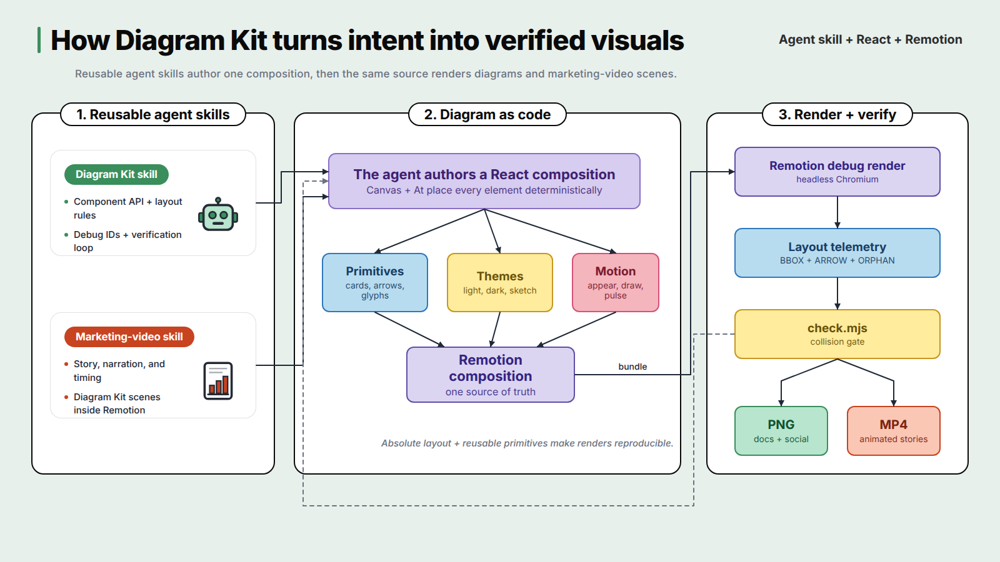
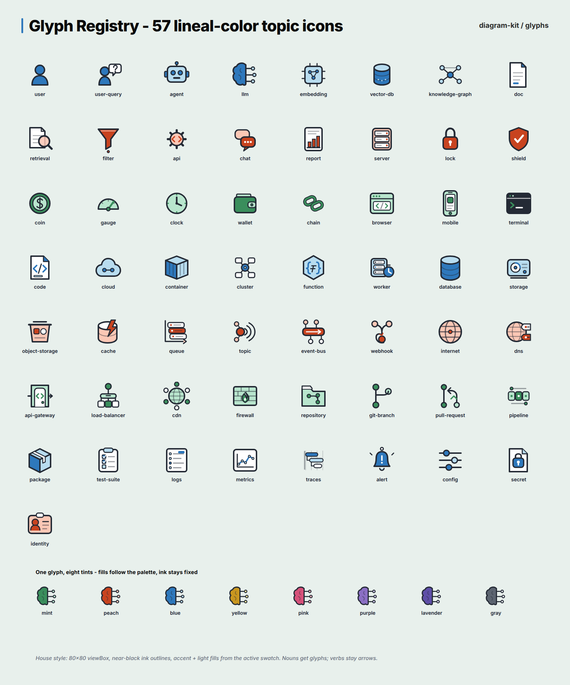

# diagram-kit

Technical diagrams and product stories as checked React code.

[](LICENSE)
[](https://react.dev/)
[](https://www.remotion.dev/)

Diagram Kit is an open-source React and Remotion toolkit for architecture
diagrams, technical explainers, page graphics, and animated product demos. An
agent or developer authors one composition, the checker rejects broken
geometry, and the same source can render to PNG or MP4.

The npm package is not published yet. Clone the repository and use the
workspace package directly.

## Contents

- [The problem](#the-problem)
- [The solution](#the-solution)
- [Architecture](#architecture)
- [Preview](#preview)
- [What ships](#what-ships)
- [Quick start](#quick-start)
- [Build your first diagram](#build-your-first-diagram)
- [Render and verify](#render-and-verify)
- [Themes and formats](#themes-and-formats)
- [Component surface](#component-surface)
- [Agent integration](#agent-integration)
- [Marketing videos](#marketing-videos)
- [Repository structure](#repository-structure)

## The problem

Technical visuals usually split into two bad workflows:

- Diagram DSLs are reproducible, but their visual vocabulary is limited.
- Canvas tools look polished, but every edit requires manual alignment.
- Animation often lives in a second project with duplicated layout and styles.
- Visual review is subjective, so overlaps and crossed arrows reach production.

The result is slow iteration, inconsistent output, and diagrams that cannot be
reliably regenerated by an agent or a build system.

## The solution

Diagram Kit treats a visual as a program:

- Compose cards, arrows, glyphs, charts, code, and page templates in React.
- Place every element with deterministic canvas coordinates.
- Reuse one theme system across static and animated output.
- Emit bounding-box, arrow, canvas, and orphan-text telemetry in debug renders.
- Fail the check when elements overlap or an arrow crosses content.
- Render the verified composition as a high-density PNG or Remotion MP4.

## Architecture

Diagram Kit is an agent-first visual pipeline. The repository skill teaches an
agent the real component API and layout rules. The agent writes a React
composition, Remotion performs a headless debug render, and `check.mjs` turns
layout telemetry into a hard collision gate before final output.

```text
Intent or prompt
      |
      v
Diagram Kit skill -> React composition -> Remotion debug render
                                               |
                                               v
                                  BBOX + ARROW + ORPHAN
                                               |
                                               v
                                      collision checker
                                        /           \
                                       v             v
                                     PNG            MP4
```

The composition remains the single source of truth. Themes, primitives,
animation timing, and output formats all build on that source.

## Preview

### Architecture and verification flow

This diagram explains Diagram Kit using Diagram Kit itself. The public source
is [`DiagramKitArchitecture.tsx`](apps/playground/src/examples/DiagramKitArchitecture.tsx).



### Glyph registry

The glyph system provides reusable topic icons with palette-aware fills and
fixed ink outlines. The public source is
[`GlyphProbe.tsx`](apps/playground/src/examples/fidelity/GlyphProbe.tsx).



### Demo video made with Diagram Kit

The scenes in this demo use Diagram Kit components inside a Remotion timeline.
Click the preview to watch it on YouTube.

[](https://youtu.be/EcWY9Y1hItA)

[Watch the demo on YouTube](https://youtu.be/EcWY9Y1hItA)

## What ships

- 40+ reusable visual building blocks.
- Four themes: light, dark, sketch, and legacy.
- Seven canvas presets for blogs, posters, slides, carousels, and print.
- Static PNG and frame-driven MP4 render pipelines.
- Collision checks for boxes, arrows, and untracked text.
- Full-page templates for listicles, comparisons, and product one-pagers.
- An agent-neutral `SKILL.md` with the API, workflow, and video conventions.
- Public fidelity probes that double as visual tests and working examples.

## Quick start

Requirements: Node.js 18.18 or newer and pnpm 10.x.

```bash
git clone https://github.com/Allen-Saji/diagram-kit.git
cd diagram-kit
pnpm install
pnpm dev
```

Remotion Studio opens at `http://localhost:3000` with the public architecture,
fidelity, and page-format compositions.

## Build your first diagram

Create `apps/playground/src/examples/HelloDiagram.tsx`:

```tsx
import React from "react";
import {
  Arrow,
  At,
  Canvas,
  Card,
  Title,
} from "@allen-saji/diagram-kit";

export const HelloDiagram: React.FC<{ debug?: boolean }> = ({
  debug = false,
}) => (
  <Canvas w={1200} h={500} debug={debug} theme="light">
    <At x={60} y={40}>
      <Title accentColor="mint">Request flow</Title>
    </At>

    <At x={240} y={250} anchor="center">
      <Card
        debugId="client"
        color="mint"
        title="Client"
        subtitle="POST /thing"
      />
    </At>

    <Arrow
      debugId="client-server"
      from={{ x: 340, y: 250 }}
      to={{ x: 660, y: 250 }}
    />

    <At x={760} y={250} anchor="center">
      <Card
        debugId="server"
        color="blue"
        title="Server"
        subtitle="validate + persist"
      />
    </At>
  </Canvas>
);
```

Register it in `apps/playground/src/Root.tsx`:

```tsx
import { HelloDiagram } from "./examples/HelloDiagram";

<Still
  id="HelloDiagram"
  component={HelloDiagram}
  width={1200}
  height={500}
/>
```

Check and render it:

```bash
node scripts/check.mjs HelloDiagram
bash scripts/render-png.sh HelloDiagram hd
```

## Render and verify

### Fast iteration

```bash
bash scripts/iterate.sh <Composition>
bash scripts/iterate.sh <Composition> --debug
```

The debug render draws tracked bounds so layout issues are visible while you
work.

### Collision gate

```bash
node scripts/check.mjs <Composition>
pnpm test:check
```

The checker inspects:

- `BBOX` records from primitives with a `debugId`.
- `ARROW` segments from routed arrows.
- `ORPHAN` rectangles for text outside tracked primitives.
- `CANVAS` coordinates used to normalize all geometry.

A collision exits with a non-zero status. The final render should only run
after the checker passes.

### PNG output

```bash
bash scripts/render-png.sh <Composition> blog
bash scripts/render-png.sh <Composition> hd
bash scripts/render-png.sh <Composition> 4k
bash scripts/render-png.sh <Composition> ultra
bash scripts/render-png.sh <Composition> 8k
```

### MP4 output

```bash
bash scripts/render-mp4.sh <Composition> tweet-16x9
bash scripts/render-mp4.sh <Composition> tweet-sq
bash scripts/render-mp4.sh <Composition> tweet-9x16
bash scripts/render-mp4.sh <Composition> blog
```

All animation must read `useCurrentFrame()`. CSS transitions and Tailwind
animation classes do not render deterministically in Remotion.

## Themes and formats

`Canvas` accepts `theme="light" | "dark" | "sketch" | "legacy"`.

| Theme | Use |
|---|---|
| `light` | Default editorial palette on a pale background. |
| `dark` | Neon accents and high-contrast protocol or CLI visuals. |
| `sketch` | Graph paper, hand-drawn typography, and asymmetric borders. |
| `legacy` | Original palette for older published compositions. |

Named canvas presets are available through `canvasPresets`:

| Preset | Dimensions | Use |
|---|---:|---|
| `bbgBlogInline` | 1456 x 819 | Blog hero or inline visual. |
| `bbgTallPoster` | 2484 x 3002 | Tall comparison or decision tree. |
| `bbgLandscapeArch` | 2472 x 1912 | Large architecture diagram. |
| `poster` | 1600 x 2000 | Listicle or layered poster. |
| `slide` | 1920 x 1080 | Presentation or video frame. |
| `carousel` | 1080 x 1350 | Portrait social card. |
| `a4` | 1240 x 1754 | Print page at 150 DPI. |

## Component surface

| Group | Components |
|---|---|
| Layout | `Canvas`, `At`, `Panel`, `SwimLanes`, `StageRail`, `SubPanelGrid`, `BandStack` |
| Content | `Card`, `FlowBox`, `FeatureCard`, `CodeBlock`, `TerminalCard`, `BulletList` |
| Relationships | `Arrow`, `FanArrow`, `TreeNode`, `RelationshipNode`, `RadialMindMap`, `Venn` |
| Visuals | `Glyph`, `BrandIcon`, `IconNode`, `Hexagon`, `Cylinder`, `MiniChart`, `DotRating` |
| Labels | `Title`, `Label`, `Annotation`, `TagChip`, `PillTitle`, `StepBadge`, `StatusIcon` |
| Identity | `LogoChip`, `AvatarChip`, `IconBadge` |
| Pages | `PageHeader`, `PageFooter`, `IconGrid`, `ComparisonTable`, `BeforeAfterSplit` |
| Motion | `Appear`, `ScaleIn`, `DrawArrow`, `Pulse`, `Hold`, `Typewriter` |
| Templates | `ListiclePoster`, `ProductOnePager`, `ComparisonColumns` |

Read [`SKILL.md`](SKILL.md) for the complete component API, props, layout rules,
scripts, and reference compositions.

## Agent integration

The repository skill is agent-neutral. It teaches the component API, the
render-check-fix loop, and the marketing-video workflow.

### Codex

```bash
mkdir -p ~/.codex/skills/diagram-kit
curl -o ~/.codex/skills/diagram-kit/SKILL.md \
  https://raw.githubusercontent.com/Allen-Saji/diagram-kit/main/SKILL.md
```

Start a new Codex session and ask it to use the Diagram Kit skill.

### Claude Code

```bash
mkdir -p ~/.claude/skills/diagram-kit
curl -o ~/.claude/skills/diagram-kit/SKILL.md \
  https://raw.githubusercontent.com/Allen-Saji/diagram-kit/main/SKILL.md
```

Start a new Claude Code session and ask it to use the Diagram Kit skill.

### Other agents

Copy `SKILL.md` to `<agent-skills-dir>/diagram-kit/SKILL.md`. Shared skill roots
such as `~/.agents/skills` work when the agent supports them.

Example requests:

```text
Use Diagram Kit to diagram the architecture of this repository.
Use Diagram Kit to animate this request flow.
Use Diagram Kit to create a narrated 60-second product demo.
```

## Marketing videos

Diagram Kit scenes can run inside a direct Remotion composition with narration,
music, transitions, and frame-accurate timing. The recommended sequence is:

1. Lock the audience, problem, solution, proof, CTA, and duration.
2. Generate or record narration first.
3. Set scene timings from the real audio duration.
4. Build each scene from Diagram Kit primitives.
5. Check static layouts and inspect representative animation frames.
6. Verify video duration, audio duration, and the final encode.

Burned-in captions are opt-in. Do not add them unless the project explicitly
requests them.

## Repository structure

```text
packages/diagram-kit/  React component library consumed as a workspace package
apps/playground/       Remotion Studio, public probes, and example compositions
apps/site/             Project landing page
scripts/               Check, iterate, PNG, MP4, and renderer helpers
docs/architecture/     Self-architecture source render
docs/samples/          Committed visual and motion samples
SKILL.md               Agent-neutral workflow and component reference
```

## Contributing

See [`CONTRIBUTING.md`](CONTRIBUTING.md). New primitives should include a public
fidelity probe under `apps/playground/src/examples/fidelity/` and pass
`pnpm test:check`.

## License

Diagram Kit is MIT licensed. Remotion has its own license terms. See
[remotion.dev/license](https://www.remotion.dev/docs/license) before commercial
use.
